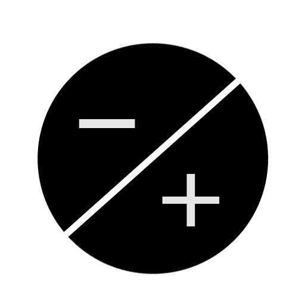
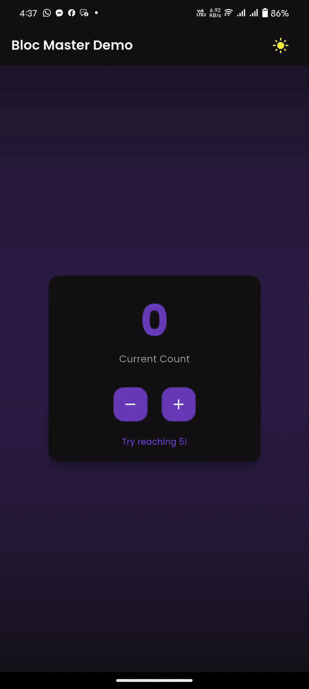
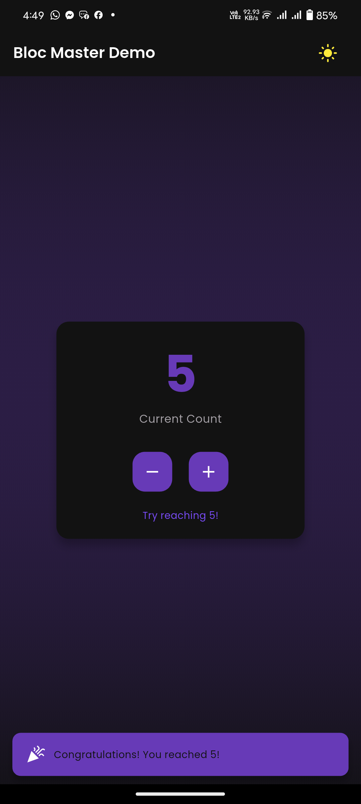
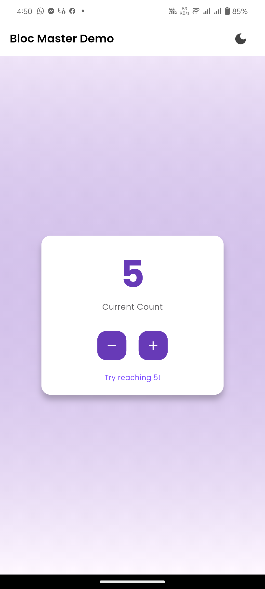

# Bloc Master Demo


<p align="center">
  
</p>

## 📱 Overview

A sophisticated Flutter application demonstrating the implementation of the BLoC pattern with an elegant UI design.


## Features

🔢 Counter Management
- Increment and decrement counter values
- Beautiful animated counter display
- Achievement notification at count 5

🎨 Theme Management
- Smooth toggle between light and dark themes
- Custom color schemes
- Persistent theme state


## 📱 App Demo

<p align="center">
  
</p>


## 📸 Screenshots

<p align="center">
  
  &nbsp;&nbsp;&nbsp;&nbsp;
  
</p>
## Technical Highlights

- Clean Architecture
- BLoC Pattern Implementation
- Custom Animations
- Responsive Design
- Google Fonts Integration
- Gradient Backgrounds
- Material Design 3 Components

## Design Features

- Custom themed cards with elevation
- Smooth color transitions
- Responsive layout
- Custom button designs
- Beautiful typography using Google Fonts
- Animated theme switching
- Achievement notifications

## Getting Started

1. Clone the repository
2. Install dependencies:
   ```bash
   flutter pub get
